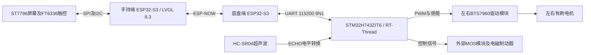

# 智能交互移动底盘控制系统

**版本状态：非最终版，持续更新中。**

本仓库记录毕业设计开发过程的阶段性成果，将随硬件联调、样板验证和功能测试持续补充代码、图纸、演示资料与测试记录。各模块的完成情况以当前成果和验证记录为准。

机械电子工程毕业设计作品集。系统采用STM32H743ZIT6、两块ESP32-S3及ST7796/FT6336触摸屏，围绕手持交互、无线指令转发、RT-Thread运动控制与超声波测距开展开发。

本仓库展示当前源代码与PCB设计成果。**软件参数不等于实测性能；底盘仍在硬件联调阶段。**

## 快速查看

- [屏幕转接PCB预览](hardware/screen-adapter/pcb-preview.png) · [原理图](hardware/screen-adapter/schematic.svg)
- [屏幕GPIO与接线说明](hardware/screen-adapter/README.md)
- [18字节通信协议](docs/protocol.md)
- [RT-Thread接入说明](docs/rtthread-integration.md)
- [验证状态与下一步测试](docs/verification.md)
- [代码入口导航](docs/code-guide.md)

## 系统架构



H743负责运动状态和联锁逻辑；底盘ESP32-S3负责无线与UART之间的转发。24V电机功率回路不经过屏幕PCB或MCU信号排针。

## 当前成果

| 模块 | 当前内容 | 验证状态 |
|---|---|---|
| 屏幕交互 | ST7796驱动、LVGL方向/停止按钮及速度滑条 | 已有实物显示反馈；触控映射需要按实物复测 |
| 屏幕转接板 | 14针2.54mm接口、去耦、GPIO丝印及安装孔 | 原理图与双层PCB草稿已完成；当前规则下DRC无报错；未打样 |
| ESP-NOW与UART | 控制帧、ACK与遥测的代码框架 | 代码已提供；尚无距离、丢包率或端到端延迟测试结果 |
| H743应用层 | 控制、测距、通信与遥测任务 | 需接入实际BSP、核对引脚并完成硬件验证 |
| 编码器及PID | 后续扩展方向 | 当前代码未接入编码器测速或闭环PID |

## 后续完善方向

- 完成ESP-NOW、UART与H743端到端联调，补充通信距离、丢包率及延迟的实测记录。
- 完成PCB打样、焊接与上电验证，更新图纸和接线说明。
- 完成电机、制动与超声波功能联调，根据实际硬件推进编码器测速和PID闭环控制。
- 持续补充构建说明、演示照片或视频及版本更新记录。

## 可核对的技术细节

- 手持端显示配置为320×480、RGB565，SPI时钟配置20MHz。
- 触摸控制器地址为0x38；GPIO映射见接线说明。
- ESP-NOW与UART共用**18字节固定帧**，使用CRC16-CCITT、帧版本、序号、指令与状态字段。
- UART配置为115200、8N1；手持端指令发送周期配置50ms。
- H743控制代码配置4kHz PWM、20ms控制周期及300ms有效指令超时判断。上述数值为源码配置，尚不是定时精度或制动性能的实测结果。
- 转接PCB尺寸约55.88×45.72mm，4个3.2mm安装孔，100nF与10μF去耦；13号针留空。

## 目录

```text
firmware/
  handheld/           ESP32-S3屏幕端ESP-IDF工程
  chassis-bridge/     第二块ESP32-S3的无线串口桥接工程
  h743-rtthread/      H743应用层代码，需接入RT-Thread BSP
hardware/
  screen-adapter/     PCB、原理图预览和接线记录
docs/                协议、代码导航、集成与验证说明
```

## 构建入口

屏幕端依赖ESP-IDF 5.5.1及LVGL 8.3.x。16MB Flash、Octal PSRAM配置来源于现有开发板工程，换板前请核对。

```bash
cd firmware/handheld
idf.py set-target esp32s3
idf.py build
```

桥接端在`firmware/chassis-bridge`目录构建。H743目录是应用组件，不是完整开发板BSP；接入方法见[RT-Thread说明](docs/rtthread-integration.md)。本次整理未重新执行ESP-IDF全量编译，不将源码整理或配置检查标为构建通过。

## 工程实践与来源

开发过程结合数据手册、已有示例、AI辅助代码迭代及用户实物调试反馈。重点展示硬件接线、屏幕适配、协议设计和接口集成过程，不将第三方示例或AI生成代码描述为完全独立从零开发。

原始屏幕工程参考[UsefulElectronics的ESP32-S3 GC9A01 LVGL示例](https://github.com/UsefulElectronics/esp32s3-gc9a01-lvgl)，本项目调整为ST7796/FT6336和移动底盘交互界面。LVGL、ESP-IDF、RT-Thread属于第三方依赖，保留各自授权；不在本仓库重新分发其完整源码。详见[来源说明](NOTICE.md)。
